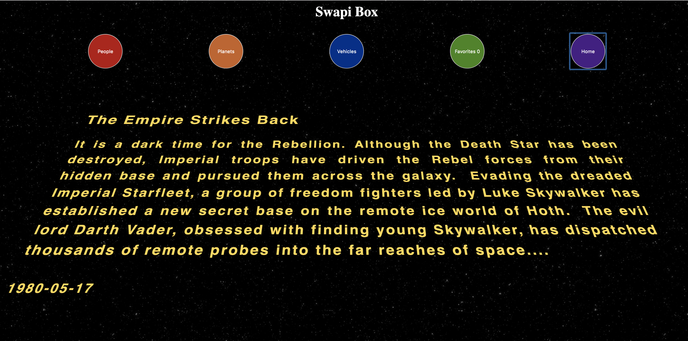
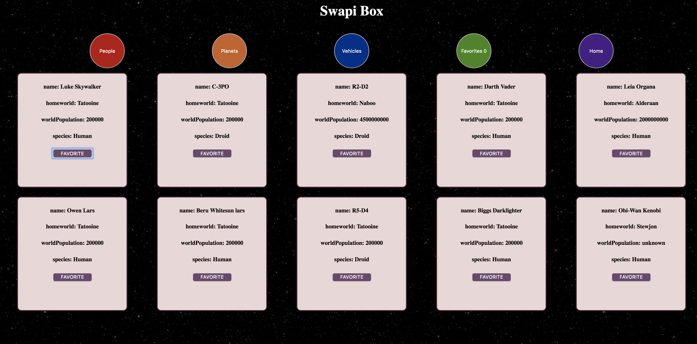
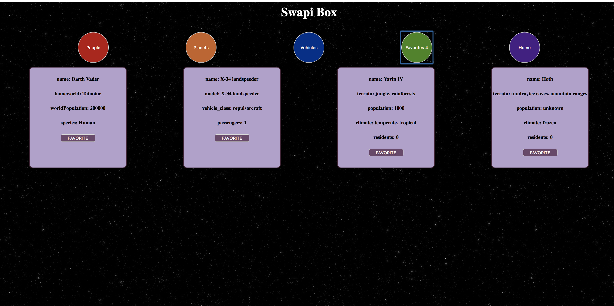

### Description

This is a project built using React components. It pulls data from The Star Wars API using native fetch(). It pulls information populating the landing screen with a movie film description with the starwars entrance crawl. The three categories of people, planets, and vehicles can be clicked and show the corresponding cards that can be favorited and then seen in the favorites category.  

### Installation

To install, first clone down this repo `https://github.com/lboyer4/SWapi-Box.git`

next run, `npm install`

### Screenshots

### Learning Goals

The learning goals of this project was to further practice building out an app with React components. To continue learning how to test with enzyme and jest, and to begin learning how to test fetch calls. 

Other goals included, learning how to use PropTypes and writing DRY code. 